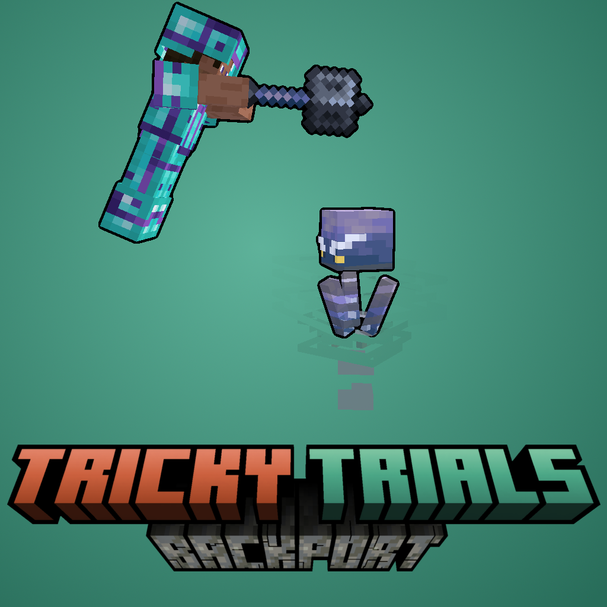

# Tricky Trials Backport

A Minecraft mod that brings the Tricky Trials experience to 1.20.1. Adding features such as the Tuff blocks, the Mace, the Wind Charge, and more.

## Dependencies

### Required
1. [Copper Age Backport](https://www.curseforge.com/minecraft/mc-mods/copper-age-backport) (For the Copper Blocks that are in the Trial Chambers)
2. [GeckoLib](https://www.curseforge.com/minecraft/mc-mods/geckolib) (For the Breeze animation)
3. [Trimmed](https://www.curseforge.com/minecraft/mc-mods/trimmed) (For the custom Armor Trims)
4. [Sherds API](https://www.curseforge.com/minecraft/mc-mods/sherdsapi) (For the custom Pottery Sherds)

### Optional
1. [Vanilla Backport](https://www.curseforge.com/minecraft/mc-mods/vanillabackport) (For the Decorated Pot loot tables and the Spawn Egg textures)

## Credits
- **Author**: Daniel Dixon (Dandi2k8)
- **Inspired by**: Minecraft's 1.21 update, Tricky Trials